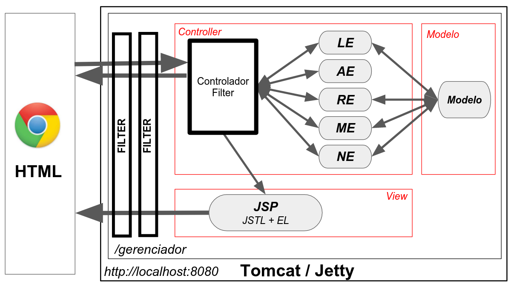
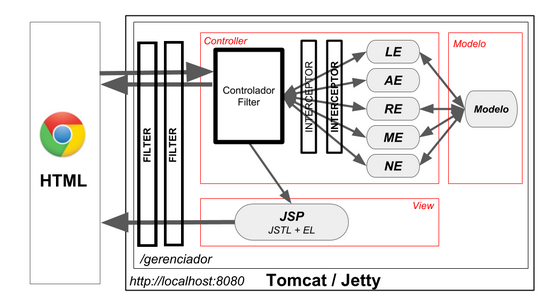
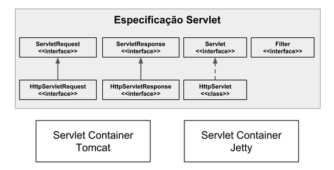

# Java Servlet: autenticação, autorização e o padrão MVC




## Aula 1. Criando o controlador

- reorganizamos a nossa aplicação em 3 pacotes: acao, modelo e servlet. Além disso, criamos uma servlet que recebe todas as requisições da aplicação (quase todas). A ideia é centralizar o acesso através dessa servlet, para que ela decida qual ação executar.

- Para tal, usamos um parâmetro da requisição que define o nome da ação. Por isso, foi necessário alterar todos os links e formulários para enviar sempre esse parâmetro.

> Servlet é uma forma de "chamar" um objeto Java a partir de uma requisição .

## Aula 2. O padrão MVC

- MVC significa Model-View-Controller
- MVC divide a aplicação em 3 camadas lógicas
- Cada camada tem a sua responsabilidade
- O controlador central e as ações fazem parte da camada Controller, que define o fluxo da aplicação
- Os JSPs fazem parte da camada View, que define a interface
- As classes do modelo fazem parte da camada Model, que encapsula as regras de negócio
- MVC facilita a manutenção e evolução da aplicação
- Os JSPs devem ficar "escondidos" na pasta WEB-INF, pois dependem da ação

## Aula 3. Formulário de login

- A representar o usuário através de uma classe Usuario
- A criar um formulário de login
- A criar a ação para chamar o formulário
- A criar a ação verificar o login e a senha

### O padrão JAAS

O Tomcat e mundo de Servlet já possuem uma forma padrão para trabalhar com login, senha, permissões e os recursos protegidos. Tudo isso pode ser configurado através do arquivo web.xml e uma pequena configuração no servidor Tomcat.

A ideia é que aplicação web defina que deve ter um login, quais são as permissões e os recursos (URLs) protegidos. Tudo isso fica no web.xml. Segue um exemplo de um web.xml que protege a URL /entrada e as páginas .html:
```
<?xml version="1.0" encoding="UTF-8"?>
<web-app xmlns:xsi="http://www.w3.org/2001/XMLSchema-instance" xmlns="http://xmlns.jcp.org/xml/ns/javaee" xsi:schemaLocation="http://xmlns.jcp.org/xml/ns/javaee http://xmlns.jcp.org/xml/ns/javaee/web-app_4_0.xsd" id="WebApp_ID" version="4.0">

    <display-name>gerenciador</display-name>

    <welcome-file-list>
        <welcome-file>bem-vindo.html</welcome-file>
    </welcome-file-list>

    <login-config>
      <auth-method>BASIC</auth-method>
    </login-config>

    <security-role>
        <role-name>ADMINISTRADOR</role-name>
    </security-role>

    <security-role>
        <role-name>USUARIO</role-name>
    </security-role>

    <security-constraint>
        <web-resource-collection>
            <web-resource-name>acesso controlador</web-resource-name>
            <url-pattern>/entrada</url-pattern>
        </web-resource-collection>
        <auth-constraint>
            <role-name>ADMINISTRADOR</role-name>
        </auth-constraint>
    </security-constraint>

    <security-constraint>
        <web-resource-collection>
            <web-resource-name>acesso a paginas html</web-resource-name>
            <url-pattern>*.html</url-pattern>
        </web-resource-collection>
        <auth-constraint>
            <role-name>USUARIO</role-name>
        </auth-constraint>
    </security-constraint>
</web-app>
```
Nesse exemplo, temos duas permissões (ROLEs): ADMINISTRADOR e USUARIO. Para acessar /entrada, precisa ser ADMINISTRADOR, e para acessar *.html, basta ser USUARIO.

No outro lado, o Tomcat fica com a responsabilidade de carregar os usuários e as permissões. Uma forma simples de fazer isso é usar o arquivo tomcat-users.xml dentro do projeto Servers, na pasta Tomcat. Basta substituir com o conteúdo abaixo, para definir dois usuários (admin e user):
```
<tomcat-users>
  <role rolename="ADMINISTRADOR"/>
  <role rolename="USUARIO"/>
  <user username="admin" password="123" roles="ADMINISTRADOR, USUARIO"/>
  <user username="user" password="123" roles="USUARIO"/>
</tomcat-users>
```
Repare que o admin possui as permissões ADMINISTRADOR e USUARIO, o user apenas USUARIO.

Tudo isso foi definido dentro de um outro padrão, chamado Java Autenthication and Authorization Service (JAAS - API padrão do Java para segurança), no entanto, ele não é tão utilizado em aplicações web Java.

## Aula 4. HttpSession

- Por padrão, o navegador não envia nenhuma identificação sobre o usuário
- Quando o Tomcat recebe uma nova requisição (sem identificação), gerará um ID
- O ID fica salvo no cookie de nome JSessionID
- O ID é um hash (número aleatório)
- O cookie é anexado à resposta HTTP
- O navegador reenvia o cookie automaticamente nas próximas requisições
- O Tomcat gera, além do ID, um objeto chamado HttpSession
- A vida do objeto HttpSession fica atrelado ao ID
- Para ter acesso à HttpSession, basta chamar request.getSession()
- Usamos a HttpSession para guardar dados sobre o usuário (login, permissões, carrinho de compra)
- A HttpSession tem um ciclo de vida e será automaticamente invalidada

### Timeout da sessão

A HttpSession tem um timeout associado. Se você não usa a nossa aplicação por um determinado tempo, o Tomcat automaticamente remove o objeto HttpSession da memória. O padrão do Tomcat 9 é de 30 minutos, ou seja, se você não usar a aplicação por 30 min, você será deslogado!!

Talvez você ache os 30 minutos pouco ou muito tempo, mas saiba que isso é configurável através do nosso web.xml, basta colocar o seguinte trecho:
```
<session-config>
    <!-- 10 min -->
    <session-timeout>10</session-timeout>
</session-config> 
```
Só reforçando: é um timeout de desuso. No caso acima, o Tomcat só removerá a sessão se o usuário não ficar ativo por 10 minutos.

## Aula 5. Aplicando filtros

- Um Filter e Servlet são bem parecidos
- Comparado com Servlet, o Filter tem o poder de parar o fluxo
- Para escrever um filtro, devemos implementar a interface javax.servlet.Filter
- Para mapear o filtro, usamos a anotação @WebFilter ou o web.xml
- Vários filtros podem funcionar numa cadeia (um chama o próximo, mas todos são independentes)
- Para definir a ordem de execução, devemos mapear os filtros no web.xml
- Um filtro recebe como parâmetro, do método doFilter, um ServletRequest e um ServletResponse
- Ambos, ServletRequest e ServletResponse, são interfaces mais genéricas do que HttpServletRequest e HttpServletResponse
- Para chamar o próximo filtro na cadeia, usamos o objeto FilterChain

### Qual é a diferença entre Filter e Interceptor?

A imagem abaixo, que mostra o uso do Filter e Interceptor:



O filtro fica antes do controlador e o interceptador depois. O filtro é um componente do mundo de Servlets e se preocupa em filtrar requisições (é ligado ao mundo web), enquanto um interceptador "filtra" chamadas de ações ou outros métodos. Os interceptadores são específicos do framework (por exemplo, Spring)
## Aula 6. Introdução ao Web Services

- Que um web service usa HTML, JSON ou XML como retorno
- Que um web service oferece alguma funcionalidade para seu cliente
- Que um web service é útil quando precisa oferecer uma funcionalidade para cliente diferentes
- Que para o web service não importa se o cliente foi escrito em Java, C# ou outra linguagem, pois usamos um protocolo e formatos independentes da plataforma
- Como gerar JSON no código Java através de GSON
- Como gerar XML no código Java através de XStream
- Como escrever um web service através de um HttpServlet
- Como criar um cliente HTTP a partir do código Java, usando a biblioteca Apache HttpClient
- Como gerar JSON ou XML a partir do cabeçalho Accept da requisição

## Aula 7. Deploy no Jetty

- A disponibilizar a nossa aplicação no servlet container Jetty
- Que Servlet é uma especificação
- Que a especificação Servlet faz parte do Java EE/Jakarta EE
- Que, ao usar Servlet, programamos independentemente do servidor/container
- A diferença entre servlet container e application server

### Servlet x HttpServlet

Falamos sobre a especificação Servlet, e assim a garantia que podemos rodar o nosso projeto em diferentes Servlet Containers. Apresentei a imagem abaixo, que mostra alguns tipos importantes da especificação, como javax.servlet.Servlet, javax.servlet.http.HttpServlet, javax.servlet.ServletRequest, javax.servlet.http.HttpServletRequest, entre outros:



Repare que existem tipos mais genéricos e tipos mais específicos, focados no protocolo HTTP, por exemplo:

```
javax.servlet.Servlet --> javax.servlet.http.HttpServlet
javax.servlet.ServletRequest --> javax.servlet.http.HttpServletRequest
javax.servlet.ServletResponse --> javax.servlet.http.HttpServletResponse
```
Tirando a interface Filter, sempre existe um tipo mais especifico do mundo HTTP. Por quê?

A ideia inicial era que o mundo Servlets suportasse outros protocolos como FTP ou SMTP. Ou seja, as servlets e os servlet containers poderiam trabalhar com outros protocolos além do HTTP. Por isso existem essas interfaces genéricas (sem Http no nome), para estender e atender novos protocolos.

Por exemplo, poderia existir um FTP Servlet Container, que atenderia o protocolo FTP e assim estender os tipos genéricos, para criar um FtpServlet, ou FtpServletRequest. No final, não existem essas implementações, e o protocolo HTTP é o único que as servlets atendem. Isso também se dá por causa da onipresença do protocolo HTTP no dia a dia, e da baixa relevância dos outros protocolos.

